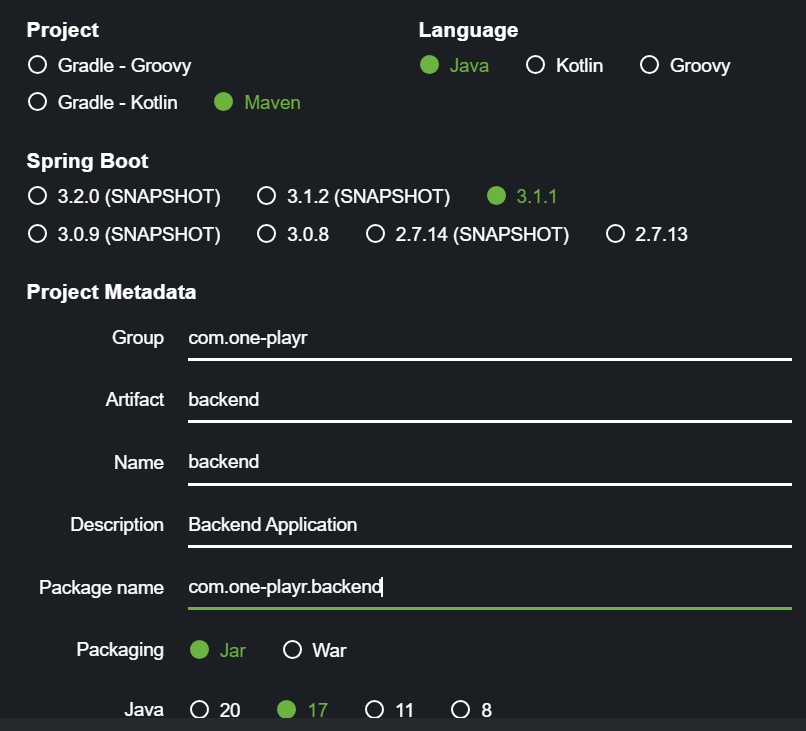
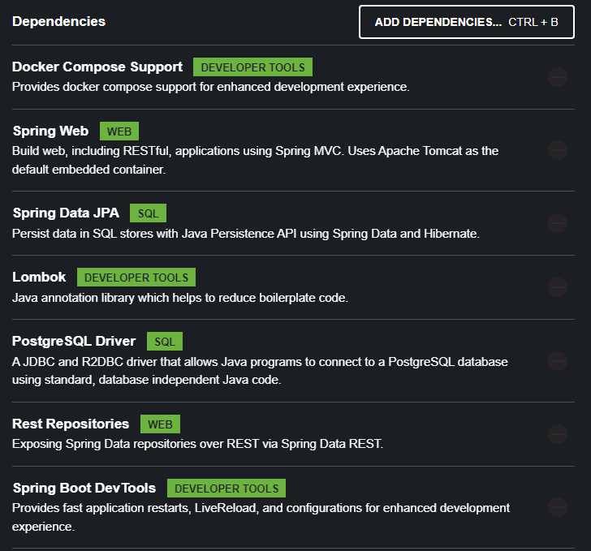

# ONE PLAYR
- Connects music platforms 

# NOTES

# Backend Setup

- Go to "start.spring.io" in browser

 - compile errors on test then you add the following to your pom.xml file.
   - <plugin>
          <groupId>org.apache.maven.plugins</groupId>
          <artifactId>maven-surefire-plugin</artifactId>
          <version>2.19.1</version>
     </plugin>

 - Use "mvn clean install" every time you run your application
 - Use "mvn spring-boot:run" to run your application

# Frontend Setup
- Create boiler plate react app in frontend folder
  - npx create-react-app frontend

  - Go to frontend dir and add some libraries
    - cd frontend
    - npm i axios date-fns

  - start up dev server     
    - npm start

# Docker